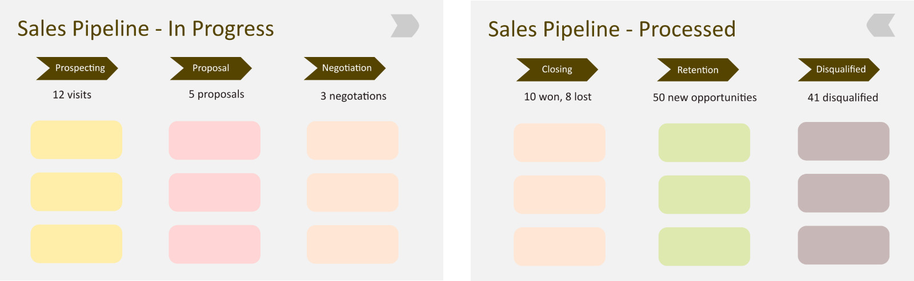

# Sales Pipeline Managing System
A comprehensive ***Sales Pipeline Managing System*** built as a ***full-stack Java web application***. This application enables employees to ***manage sales leads*** through **different stages**, from **initial contact to closure**, as visualized in the pipeline structure. This system ***supports tracking, categorizing, and updating sales records, providing clear insights into sales progress.***

## Table of Contents
- [Model Reference Image](#model-reference-image)
- [Features](#features)
- [Technologies Used](#technologies-used)
- [Setup](#setup)
- [Usage](#usage)
- [Project Structure](#project-structure)
- [Screenshots](#screenshots)
- [License](#license)

## Model Reference Image

| Stage 1                         | Stage 2                                                  |
|-------------------------------|--------------------------------------------------------------|
| Sales Pipeline - In Progress  | Sales Pipeline - In Processed |



## Features
- **Authentication and Authorization**: Secure login system to restrict access.
- **Sales Pipeline Management**: Sales can be categorized into stages such as Prospecting, Proposal, Negotiation, Closing, Retention, and Disqualification.
- **Sales Status Tracking**: Easily track the status of each sale as "In Progress" or "Processed," as shown in the pipeline stages.
- **CRUD Operations**: 
  - **Create** new sales entries.
  - **View** existing sales information with category-based filtering.
  - **Update** sales entries as they progress through the pipeline.
  - **Delete** obsolete or incorrect sales records.
- **Report Generation**: Generate sales reports based on stage categories (In Progress, Processed).
- **User Management**: Employees can create and manage their accounts with access based on roles.

## Technologies Used

### Frontend
- **HTML** - For structuring the web pages.
- **CSS** - Styling the web pages.
- **JavaScript** - Adding interactivity.
- **Tailwind CSS** - Simplified styling with utility classes.
- **jQuery** - DOM manipulation and AJAX requests.

### Backend
- **Java** - Core programming language.
- **JDBC** - For database connectivity.
- **JSP** - For server-side rendering.
- **Hibernate** - ORM for handling database operations.
- **MySQL** - Database management.

## Setup

1. **Clone the repository**
   ```bash
   git clone https://github.com/UdaySharmaGitHub/Sales-Pipeline-Manager.git
   cd Sales-Pipeline-Manager
   ```
2. **Set up the database**
    - Create a MySQL database.
    - Use the provided SQL file (if available) to set up the necessary tables or manually create tables as per the database schema.

3. **Configure Database Connection**
    - Update the database configuration in the JDBC or Hibernate properties file.

4. **Run the Application**
    - Deploy the application on a server like Apache Tomcat.
Access the application at http://localhost:8080/sales-pipeline.

## Usage
- Login with valid credentials.
- Navigate to the Sales Management section.
- ***Add New Sales:*** Create a new sales entry with details like client name, potential value, and initial status.
- ***Update Sales Status:*** Move sales from one stage to another, e.g., from Prospecting to Proposal.
- ***Delete Sales Records:*** Remove records as needed.
- ***View Reports:*** View and filter sales based on categories (In Progress or Processed).

## Project Structure
```javascript
sales-pipeline-managing-system
├── src
│   ├── main
│   │   ├── java
│   │   │   ├── com.example.pipeline
│   │   │   │   ├── controllers
│   │   │   │   ├── models
│   │   │   │   ├── dao
│   │   │   │   ├── services
│   │   │   └── utils
│   │   └── resources
│   │   └── webapp
│   │       ├── WEB-INF
│   │       ├── css
│   │       ├── js
│   │       └── views
└── pom.xml
```
## License
- This project is licensed under the MIT License. See the LICENSE file for details.
